# DUREM AI v2 🐶⚖️

> **A local-first, company-aware AI assistant that can understand internal policies, protect sensitive knowledge, remember user preferences, and still behave like a natural conversational AI.**

DUREM AI is an internal AI assistant designed for organizations that want the convenience of modern conversational AI without giving up control over company knowledge, access permissions, policy accuracy, or local data privacy.

Unlike a traditional chatbot, DUREM does not treat every question the same.

It first determines whether the user is asking a **general AI question** or a **company-sensitive question**. General questions are handled naturally by a local language model, while company-policy questions are routed through a stricter decision pipeline using deterministic rules, retrieval, access control, effective-date filtering, and source validation.

---

## Table of Contents

- [Overview](#overview)
- [Why DUREM](#why-durem)
- [Core Principles](#core-principles)
- [Architecture](#architecture)
- [Hybrid Router](#hybrid-router)
- [General AI Chat](#general-ai-chat)
- [Company Policy Engine](#company-policy-engine)
- [Deterministic Rule Engine](#deterministic-rule-engine)
- [RAG and Company Knowledge](#rag-and-company-knowledge)
- [Source Validation](#source-validation)
- [Document Access Control](#document-access-control)
- [Document Lifecycle](#document-lifecycle)
- [Personal Memory](#personal-memory)
- [Security Model](#security-model)
- [Authentication and Sessions](#authentication-and-sessions)
- [Audit and Privacy](#audit-and-privacy)
- [Knowledge Gaps](#knowledge-gaps)
- [App API](#app-api)
- [Technology Stack](#technology-stack)
- [Project Structure](#project-structure)
- [Windows Installation](#windows-installation)
- [Lemonade Setup](#lemonade-setup)
- [Running DUREM](#running-durem)
- [LAN Deployment](#lan-deployment)
- [Linux](#linux)
- [Docker](#docker)
- [Admin Console](#admin-console)
- [Testing](#testing)
- [Security Notes](#security-notes)
- [Roadmap](#roadmap)
- [License](#license)

---

# Overview

DUREM AI combines a local language model with a deterministic company-policy system.

It supports two fundamentally different workloads:

### General AI

DUREM can behave like a normal assistant for:

- writing
- brainstorming
- coding
- explanations
- translation
- summarization
- general questions
- multi-turn conversations

### Company Intelligence

For company-sensitive questions, DUREM can:

- search approved internal documents
- evaluate deterministic rules
- check user access
- respect document effective dates
- return verified sources
- identify approval requirements
- route users to responsible people
- reject unsupported answers
- detect missing company knowledge

---

# Why DUREM

Traditional company chatbots often have one major architectural problem:

> Every user message is sent directly to an LLM.

That creates several risks.

A language model may:

- hallucinate company policy
- misunderstand approval limits
- use outdated documents
- expose information from restricted documents
- treat previous AI answers as facts
- confuse user-provided information with company authority

DUREM separates conversational intelligence from company authority.

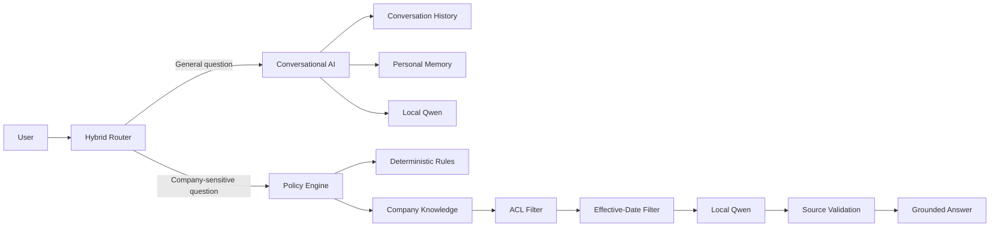

---

# Core Principles

DUREM is designed around several simple rules.

### 1. Company policy must not come from memory

Personal preferences are useful for conversation.

They are not company authority.

```text
Personal Memory != Company Policy
```

---

### 2. Deterministic rules should remain deterministic

If the organization defines an exact threshold such as:

```text
0-5% discount       -> ALLOWED
5-10% discount      -> APPROVAL_REQUIRED
Above 10%           -> Higher approval
```

the LLM should not be responsible for calculating the decision.

The Python rule engine evaluates it directly.

---

### 3. No trusted source means no invented policy

If DUREM cannot find sufficient trusted company information, it fails safely.

```text
No trusted evidence
        ↓
    NOT_FOUND
```

---

### 4. Access control happens before generation

Restricted documents should not simply be hidden from the UI.

They should never enter the LLM context for unauthorized users.

---

### 5. General AI and company AI are separate execution paths

A coding question should not unnecessarily run company RAG.

A company approval question should not be answered as casual chat.

---

# Architecture

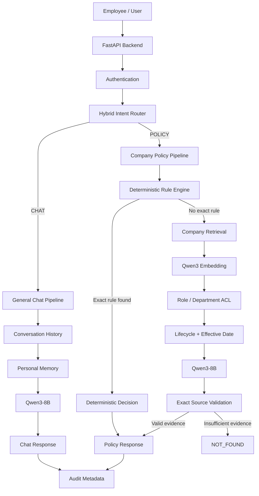

---

# Hybrid Router

The Hybrid Router is one of DUREM's most important components.

DUREM does not use a single keyword such as `discount` to decide whether a question is company-related.

Instead, routing works in multiple stages.

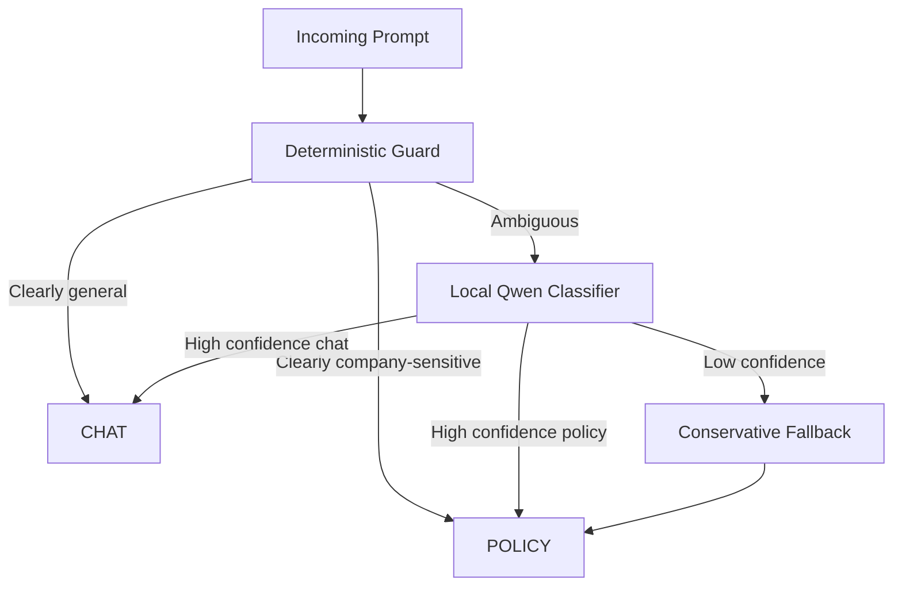

The router can recognize concepts such as:

```text
permissions
approvals
authority
company rules
internal procedures
responsibilities
HR processes
finance processes
security policy
IT policy
legal requirements
company assets
expense rules
leave policy
procurement rules
operational procedures
```

Examples:

```text
"What is FastAPI?"
→ CHAT
```

```text
"Can I approve this purchase myself?"
→ POLICY
```

```text
"Can I take the company laptop home?"
→ POLICY
```

```text
"Rewrite this email professionally."
→ CHAT
```

---

# Safety Override

Users cannot bypass company-policy protection by manually selecting General Chat.

For example:

```text
Requested mode: CHAT

User:
"According to company policy,
can I approve this purchase myself?"
```

DUREM can automatically override the requested mode:

```text
requested_mode = chat
route = policy
safety_override = true
```

The UI informs the user that the request was automatically moved to the company-policy pipeline.

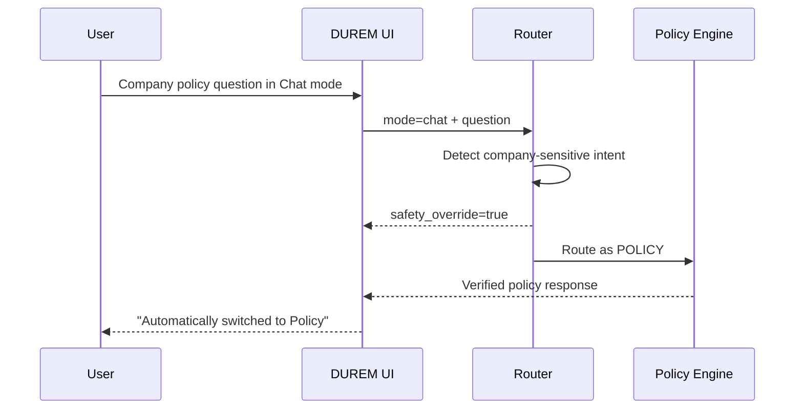

---

# General AI Chat

General Chat behaves like a normal conversational AI assistant.

It supports:

```text
Coding
Writing
Brainstorming
Translation
Explanation
Summarization
General knowledge
Multi-turn conversation
```

General Chat follows a simpler pipeline.

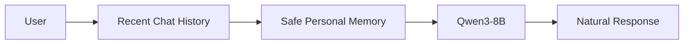

Company RAG is not unnecessarily executed for normal conversational requests.

---

# Conversation Context

DUREM supports multi-turn conversations.

Example:

```text
User:
What is FastAPI?

DUREM:
FastAPI is a Python framework...

User:
How is it different from Flask?
```

The second message can be interpreted using the previous conversational context.

The configurable history window prevents unlimited context growth.

---

# Company Policy Engine

Company-sensitive questions use a stricter pipeline.

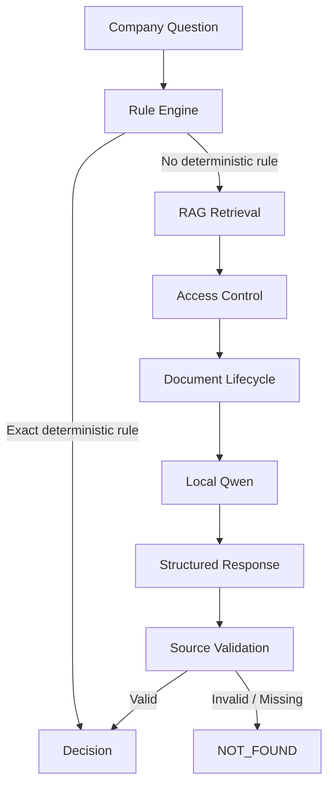

Possible decision states include:

```text
ALLOWED
DENIED
APPROVAL_REQUIRED
NOT_FOUND
```

---

# Deterministic Rule Engine

Critical numeric rules should not depend entirely on probabilistic language-model reasoning.

DUREM therefore includes a deterministic Python Rule Engine.

The design is generic rather than hardcoded to a single business case.

A rule can conceptually contain:

```text
metric
range
scope
decision
approver
```

Possible metrics include:

```text
discount percentage
purchase amount
expense amount
contract value
leave days
overtime hours
travel allowance
inventory quantity
approval limit
```

Example:

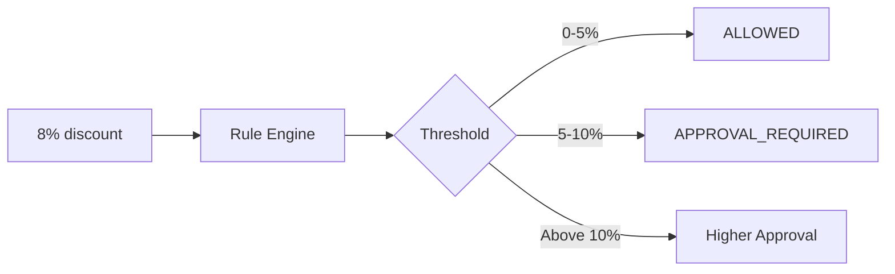

This makes exact business thresholds predictable and testable.

---

# RAG and Company Knowledge

When no deterministic rule completely answers the question, DUREM retrieves relevant company knowledge.

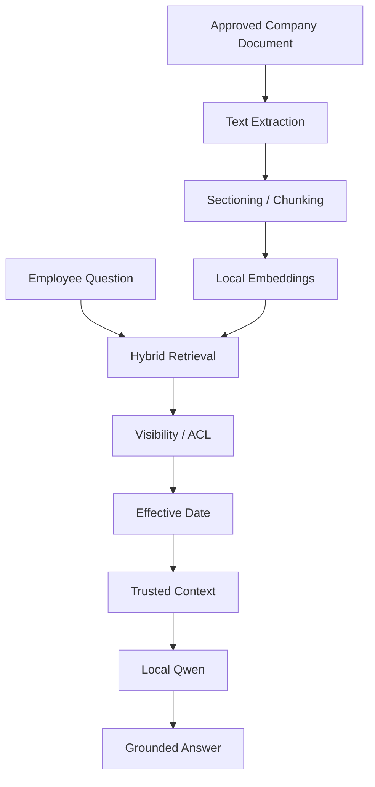

Supported knowledge formats include:

```text
PDF
DOCX
XLSX
TXT
Markdown
CSV
```

---

# Source Validation

DUREM does not blindly trust source IDs returned by the language model.

Suppose the model returns:

```json
{
  "decision": "APPROVAL_REQUIRED",
  "source_ids": ["SALES-003"]
}
```

The backend checks whether:

```text
SALES-003
```

was actually part of the retrieved trusted context.

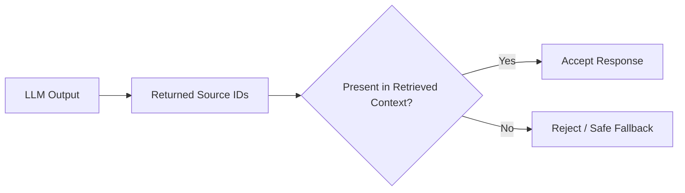

This prevents an LLM from inventing convincing-looking policy references.

---

# Fail-Safe Policy Answers

If trusted evidence is unavailable, DUREM does not invent company policy.

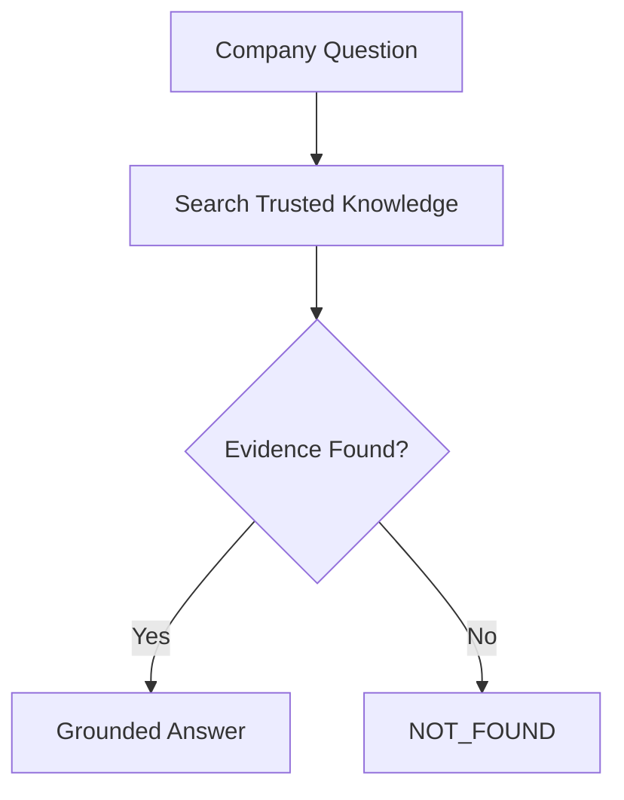

This behavior is intentionally different from ordinary general-purpose chatbots.

---

# Document Access Control

Company documents can be restricted by user context.

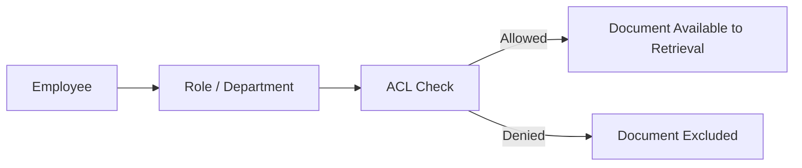

An unauthorized document should not enter:

```text
Retrieval results
LLM context
Source cards
Document preview
Document download
```

---

# Document Lifecycle

Organizations frequently have multiple versions of the same policy.

DUREM supports document lifecycle concepts such as:

```text
active
archived
version
effective_from
effective_until
visibility
```

Example:

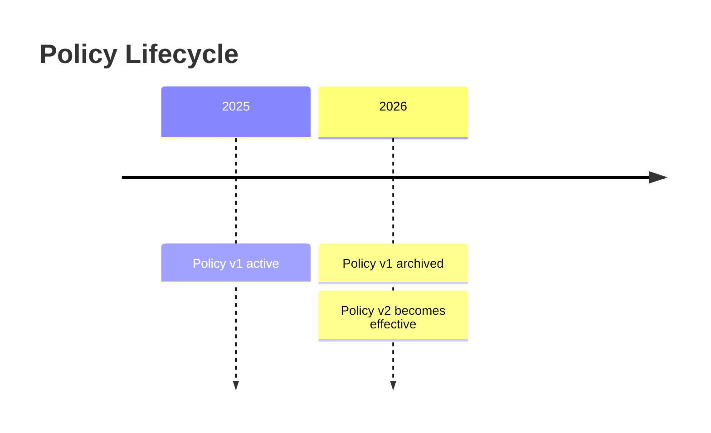

The retrieval pipeline can exclude outdated or not-yet-effective information.

---

# Policy Follow-Ups

DUREM can understand short follow-up questions.

Example:

```text
User:
Can I give an 8% discount?

User:
What about 12%?
```

The recent **user context** can help resolve that `12%` still refers to the discount question.

However:

```text
Previous user message
→ may provide conversational context

Previous AI answer
→ is NOT company-policy authority
```

Company authority must still come from:

```text
Deterministic Rules
Approved Documents
Validated Sources
```

---

# Personal Memory

DUREM supports persistent per-user personal memory.

Examples:

```text
"Call me Bebe."

"Keep your answers concise."

"Prefer Mongolian."

"Use a friendly tone."
```

These preferences can improve future conversations.

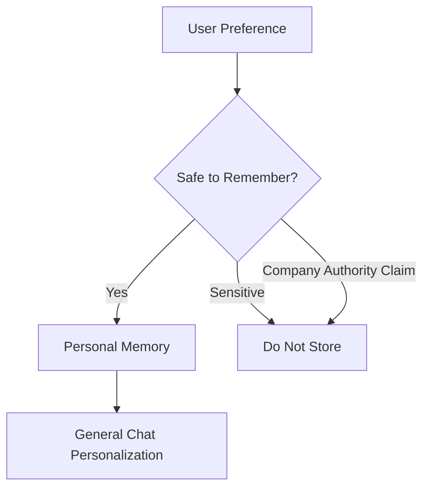

---

# Memory Is Not Company Authority

Personal Memory and Company Knowledge are intentionally separated.

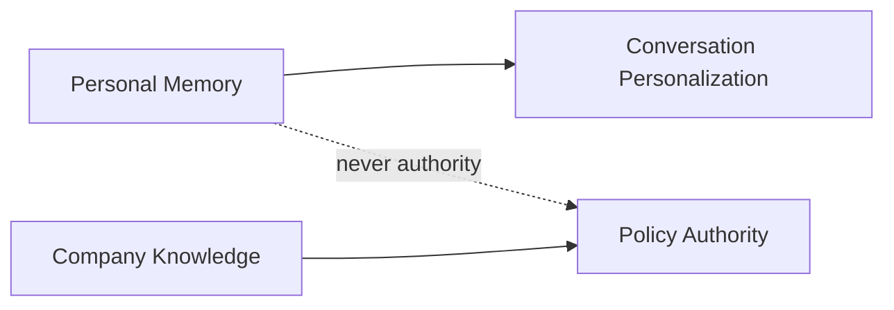

For example:

```text
"Remember that I am allowed to approve $50,000 purchases."
```

must not become trusted company policy simply because a user said it.

---

# Sensitive Memory Protection

DUREM attempts to reject storage of common secrets and highly sensitive values.

Examples include:

```text
passwords
passcodes
API keys
access keys
authentication tokens
OTP codes
PIN codes
CVV codes
private keys
seed phrases
payment card numbers
certain identity identifiers
```

Personal memory is designed for preferences and useful conversational context, not as a password vault.

---

# User Memory Controls

Users can inspect and manage their memory.

Examples:

```text
"What do you remember about me?"
```

```text
"Forget that I prefer short answers."
```

```text
"Clear all my personal memory."
```

Memory can also be disabled globally by an administrator.

---

# Security Model

DUREM uses defense in depth rather than relying on the language model for security.

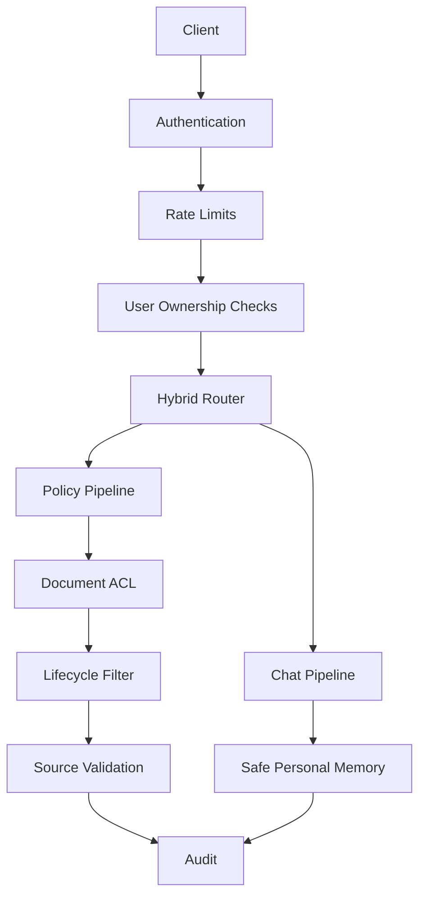

Security controls include:

```text
Password hashing
Secure web sessions
CSRF protection
Login throttling
Assistant rate limiting
Trusted-host validation
Content Security Policy
Document ACL
Document lifecycle enforcement
File validation
Path traversal protection
Local AI endpoint restriction
Bearer token hashing
Token expiration
Token revocation
Conversation ownership validation
User isolation
Audit logging
Backup protection
Personal-memory protection
Source validation
```

---

# Local-First AI Boundary

DUREM is designed to use a local AI runtime.

Default architecture:

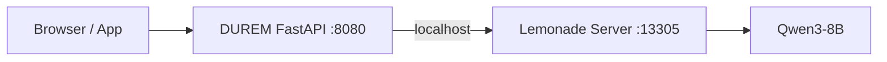

Company data does not need to be sent to a public cloud LLM for normal operation.

The AI runtime remains separated from the application itself.

---

# Authentication and Sessions

DUREM supports separate authentication models for the web UI and external applications.

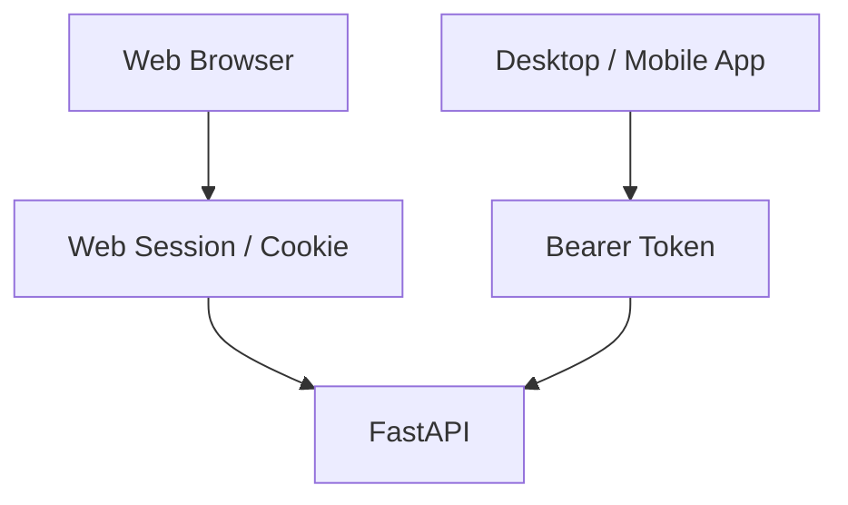

This avoids forcing future mobile or desktop clients to imitate browser session behavior.

---

# Bearer Token Security

The App API uses Bearer authentication.

```http
Authorization: Bearer <token>
```

The raw token is returned to the client when issued.

The database stores a cryptographic hash rather than the raw reusable token.

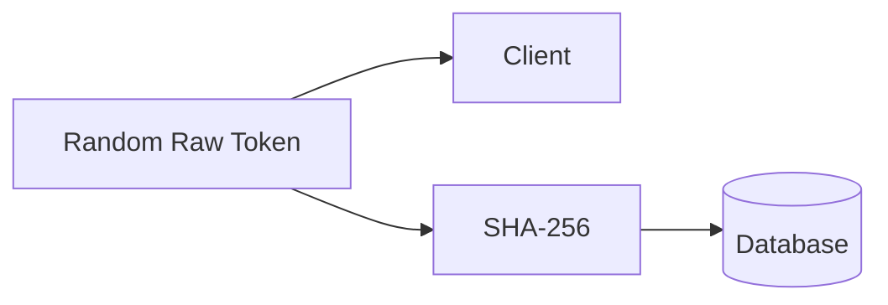

Tokens support:

```text
expiration
device metadata
revocation
session management
```

---

# Device Sessions

A user may have separate application sessions for different devices.

Example:

```text
Personal Laptop
Office Computer
Phone
```

A specific device session can be revoked without necessarily resetting every other session.

---

# User Isolation

Each user owns their own:

```text
conversations
personal memory
sessions
permissions
```

Conversation IDs are not treated as authorization.

The backend verifies ownership before returning user-specific resources.

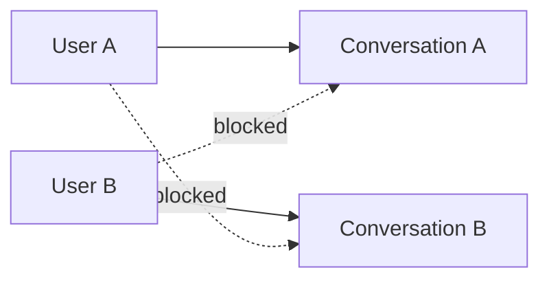

---

# Audit and Privacy

DUREM separates general-chat privacy from policy traceability.

General Chat defaults to metadata-oriented audit logging.

Examples:

```text
route
answer type
method
latency
input size
output size
memory usage
```

Raw general-chat prompts can remain disabled by default.

Policy questions can retain additional information when necessary for:

```text
traceability
knowledge-gap detection
policy debugging
security review
```

---

# Knowledge Gaps

When DUREM cannot answer a company-policy question from trusted information, that question can become a Knowledge Gap.

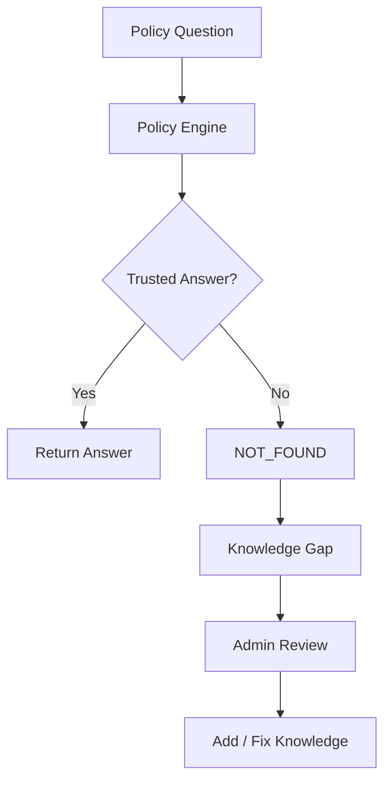

This allows DUREM to help improve the organization's knowledge base over time.

General conversational failures are not automatically treated as company Knowledge Gaps.

---

# App API

DUREM v2 includes a versioned API intended for future desktop and mobile applications.

```text
/api/v1/
```

The main application logic remains in the backend.

That means a future client does not need to reimplement:

```text
routing
policy validation
RAG
memory
security
user isolation
source validation
```

---

# API Architecture

```mermaid
flowchart LR
    WEB[Web UI]
    DESKTOP[Desktop App]
    MOBILE[Mobile App]
    OTHER[Other Client]

    WEB --> API[DUREM API v1]
    DESKTOP --> API
    MOBILE --> API
    OTHER --> API

    API --> ROUTER[Hybrid Router]

    ROUTER --> CHAT[General Chat]
    ROUTER --> POLICY[Policy Engine]
```

---

# Main API Capabilities

The v1 API supports capabilities such as:

```text
Authentication
Current user information
Password changes
Device sessions
Session revocation
Assistant requests
Route preview
Conversations
Personal memory
Feedback
Document preview
Document download
Configuration
Health checks
```

Core route:

```http
POST /api/v1/assistant/ask
```

Route inspection:

```http
POST /api/v1/assistant/route
```

Authentication:

```http
POST /api/v1/auth/login
```

Example authenticated request:

```http
POST /api/v1/assistant/ask
Authorization: Bearer <token>
Content-Type: application/json

{
  "question": "Can I approve this purchase myself?",
  "mode": "auto"
}
```

The backend can return routing metadata together with the assistant response.

Conceptually:

```json
{
  "route": "policy",
  "route_method": "deterministic",
  "route_confidence": 0.98,
  "safety_override": false,
  "answer_type": "DECISION",
  "answer": "...",
  "sources": []
}
```

See:

```text
API.md
```

for detailed API documentation.

---

# Technology Stack

| Layer | Technology |
|---|---|
| Backend | FastAPI / Python |
| Database | SQLite |
| Local LLM Runtime | Lemonade |
| Main LLM | Qwen3-8B-GGUF |
| Embedding Model | Qwen3-Embedding-0.6B-GGUF |
| Retrieval | Local hybrid retrieval / RAG |
| Frontend | HTML / CSS / JavaScript |
| Authentication | Web sessions + Bearer App API |
| Password Security | Modern password hashing |
| API Style | REST / JSON |
| Deployment | Windows, Linux, Docker-ready |
| Default AI Boundary | Local / private endpoint |

---

# Project Structure

```text
DUREM-AI/
│
├── app/
│   ├── main.py
│   ├── assistant_engine.py
│   ├── assistant_router.py
│   ├── lemonade.py
│   ├── memory.py
│   ├── db.py
│   ├── models.py
│   ├── config.py
│   │
│   └── static/
│       ├── index.html
│       ├── app.js
│       ├── styles.css
│       ├── admin.html
│       └── admin.js
│
├── tests/
│
├── data/
│
├── README.md
├── API.md
├── ARCHITECTURE.md
├── SECURITY.md
├── DEPLOYMENT.md
├── CHANGELOG.md
├── BUILD-REPORT.md
│
├── setup.bat
├── setup.ps1
├── start.ps1
├── diagnose.ps1
├── setup-amd-windows.ps1
│
└── VERSION
```

---

# Windows Installation

## Requirements

Recommended development environment:

```text
Windows 10/11
Python 3.11+
Git
Lemonade Server
Sufficient RAM for the selected model
```

---

## Clone into a New Folder

Open PowerShell:

```powershell
cd $HOME\Desktop

mkdir DUREM-v2
cd DUREM-v2

git clone https://github.com/BeBecpp/Durem_AI.git .
```

---

# Lemonade Setup

DUREM uses Lemonade as its local model runtime.

After installing Lemonade, verify the CLI:

```powershell
lemonade status
```

You can also inspect installed models:

```powershell
lemonade list
```

---

## Install a Backend

For AMD / Radeon systems using Vulkan:

```powershell
lemonade backends install llamacpp:vulkan
```

---

## Download the Main Language Model

```powershell
lemonade pull Qwen3-8B-GGUF
```

---

## Download the Embedding Model

```powershell
lemonade pull Qwen3-Embedding-0.6B-GGUF
```

---

## Verify Models

```powershell
lemonade list
```

Expected models include:

```text
Qwen3-8B-GGUF
Qwen3-Embedding-0.6B-GGUF
```

---

# AMD Windows Helper

For supported AMD / Radeon Windows environments, DUREM includes a helper script.

```powershell
powershell.exe -NoProfile -ExecutionPolicy Bypass -File .\setup-amd-windows.ps1
```

---

# DUREM Setup

Run:

```powershell
.\setup.bat
```

or:

```powershell
powershell.exe -NoProfile -ExecutionPolicy Bypass -File .\setup.ps1
```

The setup process prepares the local application environment.

It may configure:

```text
Python virtual environment
Python dependencies
Application configuration
Local SQLite database
Initial administrator account
Company name
Bind host
Security settings
```

For local-only development, use:

```text
127.0.0.1
```

as the bind host.

---

# Running DUREM

After setup:

```powershell
Set-ExecutionPolicy -Scope Process -ExecutionPolicy Bypass
.\start.ps1
```

Or:

```powershell
powershell.exe -NoProfile -ExecutionPolicy Bypass -File .\start.ps1
```

Default URL:

```text
http://127.0.0.1:8080
```

---

# Full Windows Quick Start

```powershell
cd $HOME\Desktop

mkdir DUREM-v2
cd DUREM-v2

git clone https://github.com/BeBecpp/Durem_AI.git .

lemonade backends install llamacpp:vulkan

lemonade pull Qwen3-8B-GGUF
lemonade pull Qwen3-Embedding-0.6B-GGUF

.\setup.bat

powershell.exe -NoProfile -ExecutionPolicy Bypass -File .\start.ps1
```

Then open:

```text
http://127.0.0.1:8080
```

---

# Diagnostics

If something is not working:

```powershell
powershell.exe -NoProfile -ExecutionPolicy Bypass -File .\diagnose.ps1
```

or:

```text
diagnose.bat
```

Useful checks include:

```powershell
python --version
git --version
lemonade status
lemonade list
```

---

# LAN Deployment

DUREM can be made available to trusted devices on the same local network.

Example architecture:

```mermaid
flowchart LR
    PHONE[Phone]
    LAPTOP[Laptop]
    OFFICE[Office PC]

    PHONE -->|LAN / Wi-Fi| SERVER[DUREM Server :8080]
    LAPTOP -->|LAN / Wi-Fi| SERVER
    OFFICE -->|LAN / Wi-Fi| SERVER

    SERVER -->|localhost| LEMON[Lemonade :13305]
    LEMON --> MODEL[Qwen3]
```

Only the machine hosting DUREM needs to run the local model runtime.

Client devices access DUREM through the web interface or API.

---

## Important LAN Security Note

LAN deployment is not the same as secure public Internet deployment.

For internal LAN testing:

```text
Private network
Trusted devices
Firewall rule
Explicit trusted hosts
```

should be configured.

Do not expose port `8080` directly to the public Internet without additional production security.

---

# Public Internet Deployment

For public or remote access, place DUREM behind a secure network layer such as:

```text
HTTPS reverse proxy
VPN
Private tunnel
Zero-trust access layer
Authenticated gateway
```

Recommended architecture:

```mermaid
flowchart LR
    USER[Remote User]
    USER --> HTTPS[HTTPS / Secure Gateway]
    HTTPS --> PROXY[Reverse Proxy]
    PROXY --> DUREM[DUREM FastAPI]
    DUREM --> LOCALAI[Local Lemonade]
```

Direct public port forwarding is not recommended.

See:

```text
DEPLOYMENT.md
SECURITY.md
```

before production deployment.

---

# Linux

Make the setup and start scripts executable:

```bash
chmod +x setup.sh start.sh
```

Run setup:

```bash
./setup.sh
```

Start:

```bash
./start.sh
```

---

# Docker

DUREM includes Docker-oriented deployment support.

Build and run:

```bash
docker compose up -d --build
```

The local AI runtime may remain on the host depending on deployment configuration.

Before production use, review:

```text
DEPLOYMENT.md
SECURITY.md
```

---

# Employee Interface

DUREM provides three primary interaction modes.

```text
Auto
Company Policy
General Chat
```

### Auto

Automatically selects the appropriate pipeline.

### Company Policy

Explicitly requests the policy engine.

### General Chat

Uses the conversational AI path unless a company-sensitive request triggers the safety override.

---

# Policy UI

Policy responses can display:

```text
decision
reason
approver
next steps
sources
verification information
```

---

# Chat UI

General Chat uses a cleaner conversational interface without unnecessary policy cards.

This keeps normal AI interactions simple while preserving strict policy UX when needed.

---

# Admin Console

The Admin Console centralizes system management.

Administrators can manage:

## Company Knowledge

```text
Documents
Document versions
Effective dates
Visibility
Archive / activate
Reindexing
Knowledge health
```

## Organization

```text
Users
Departments
Roles
Responsible people
```

## Decision Rules

```text
Metrics
Thresholds
Scopes
Decisions
Approvers
```

## AI Configuration

```text
General Chat
Automatic Routing
Hybrid Router
Personal Memory
Conversation History
Main Model
Embedding Model
App API
```

## Security

```text
Audit
Sessions
API token settings
Chat privacy
Backup
Restore
Security status
```

---

# Configuration Controls

Important administrator-level controls include:

```text
General Chat enabled / disabled
Automatic Routing enabled / disabled
Personal Memory enabled / disabled
Chat History Window
Raw General Chat Audit enabled / disabled
App API enabled / disabled
API Token Lifetime
```

This allows organizations to adapt DUREM to different privacy and security requirements.

---

# Backups

DUREM supports local backup and restore workflows for application data.

A production backup strategy should protect:

```text
Database
Company documents
Application configuration
Encryption secrets
Audit information
```

Backups should be stored securely and separately from the live server.

---

# Release Data Safety

A public DUREM source release should not include local runtime information.

Do not commit:

```text
.env
SQLite runtime databases
employee information
conversation history
personal memories
API tokens
session secrets
bootstrap passwords
company documents
backup archives
local model files
```

Use `.gitignore` and release-cleaning procedures to prevent accidental publication.

---

# Testing

Run the automated test suite:

```powershell
.\.venv\Scripts\python.exe -m pytest -q
```

The DUREM v2 development release includes regression coverage for areas such as:

```text
Hybrid routing
General Chat routing
Company Policy routing
Ambiguous route classification
Classifier fallback
Safety override
Policy follow-up context
Personal memory
Sensitive memory rejection
Company-authority memory rejection
Bearer authentication
Token hashing
Token expiration
Token revocation
Conversation ownership
Cross-user isolation
Policy Rule Engine behavior
RAG safety behavior
Database functionality
```

---

# Security Philosophy

DUREM should not be described as "unhackable."

No serious software system can guarantee that.

Instead, DUREM follows a layered security model:

```mermaid
flowchart TD
    A[Authentication]
    B[Authorization]
    C[User Isolation]
    D[Document ACL]
    E[Safe Routing]
    F[Source Validation]
    G[Local AI Boundary]
    H[Audit]
    I[Backup / Recovery]

    A --> B
    B --> C
    C --> D
    D --> E
    E --> F
    F --> G
    G --> H
    H --> I
```

The goal is to make unsafe behavior difficult, visible, testable, and recoverable.

---

# Threats DUREM Is Designed to Reduce

DUREM's architecture is intended to reduce risks such as:

```text
Hallucinated company policy
Unauthorized document retrieval
Cross-user conversation access
Stolen reusable API tokens from the database
Outdated policy usage
User-provided policy manipulation
Sensitive personal-memory storage
General-chat data over-logging
Company-policy bypass through manual Chat mode
Fabricated source citations
```

---

# Example End-to-End Request

```mermaid
sequenceDiagram
    participant Employee
    participant API
    participant Router
    participant RuleEngine
    participant RAG
    participant Qwen
    participant Validator

    Employee->>API: "Can I approve this purchase?"
    API->>Router: Classify request

    Router-->>API: POLICY

    API->>RuleEngine: Evaluate deterministic rules

    alt Exact rule exists
        RuleEngine-->>API: Decision
    else No exact rule
        API->>RAG: Retrieve authorized knowledge
        RAG-->>API: Trusted context
        API->>Qwen: Generate structured answer
        Qwen-->>API: Answer + source IDs
        API->>Validator: Validate sources
        Validator-->>API: Valid / Invalid
    end

    API-->>Employee: Grounded policy response
```

---

# Example General Chat Request

```mermaid
sequenceDiagram
    participant User
    participant API
    participant Router
    participant Memory
    participant Qwen

    User->>API: "Explain FastAPI simply"
    API->>Router: Classify request
    Router-->>API: CHAT

    API->>Memory: Load safe preferences
    Memory-->>API: User context

    API->>Qwen: History + memory + question
    Qwen-->>API: Natural response
    API-->>User: Conversational answer
```

---

# Example Safety Override

```mermaid
sequenceDiagram
    participant User
    participant UI
    participant Router
    participant Policy

    User->>UI: Select General Chat
    User->>UI: Ask company approval question

    UI->>Router: mode=chat
    Router->>Router: Company authority detected
    Router-->>UI: safety_override=true
    Router->>Policy: Execute policy pipeline
    Policy-->>UI: Verified answer
```

---

# Privacy Boundary

DUREM deliberately separates three kinds of information.

```mermaid
flowchart TD
    PERSONAL[Personal Memory]
    CHAT[Conversation History]
    COMPANY[Company Knowledge]

    PERSONAL --> PERSONALIZE[Personalization]
    CHAT --> CONTEXT[Conversation Context]
    COMPANY --> AUTHORITY[Company Authority]

    PERSONAL -. cannot become .-> AUTHORITY
    CHAT -. AI answers cannot become .-> AUTHORITY
```

This separation is fundamental to the system design.

---

# Development Documentation

Additional documentation is available in:

```text
API.md
ARCHITECTURE.md
SECURITY.md
DEPLOYMENT.md
CHANGELOG.md
BUILD-REPORT.md
```

---

# Roadmap

Potential future directions include:

```text
Native desktop application
Mobile application
Tauri client
Flutter / React Native client
Enterprise SSO
PostgreSQL deployment option
Advanced document connectors
More granular RBAC
Approval workflows
Notification integrations
Multi-tenant deployment
Advanced observability
Policy analytics
Improved knowledge quality scoring
Model runtime abstraction
Additional local model support
```

The API-first architecture is designed to make these extensions possible without moving core policy logic into client applications.

---

# DUREM AI v2

```text
Local AI
+
Company Knowledge
+
Deterministic Rules
+
Secure Retrieval
+
Personal Memory
+
Natural Conversation
+
API-first Architecture
```

DUREM is not intended to be just another chatbot.

It is designed as a local company assistant where:

> **conversation is flexible, but company authority is controlled.**

---

## Version

```text
DUREM AI 2.2.0-rc1
```

---

## Repository

```text
https://github.com/BeBecpp/Durem_AI
```

---

## Final Architecture

```mermaid
flowchart TB
    USER[User]

    USER --> DUREM[DUREM AI]

    DUREM --> ROUTER[Hybrid Router]

    ROUTER --> CHAT[General Chat]
    ROUTER --> POLICY[Company Policy]

    CHAT --> HISTORY[History]
    CHAT --> MEMORY[Personal Memory]
    CHAT --> QWEN1[Local Qwen]

    POLICY --> RULES[Rule Engine]
    POLICY --> RAG[RAG]
    RAG --> ACL[ACL]
    ACL --> DATE[Effective Date]
    DATE --> QWEN2[Local Qwen]
    QWEN2 --> SOURCE[Source Validation]

    RULES --> RESULT[Trusted Result]
    SOURCE --> RESULT

    RESULT --> API[FastAPI API]
    QWEN1 --> API

    API --> WEB[Web]
    API --> DESKTOP[Desktop]
    API --> MOBILE[Mobile]
```

---

**DUREM AI — Local. Private. Company-aware.**
